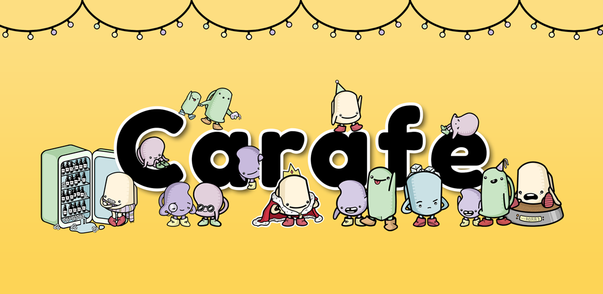
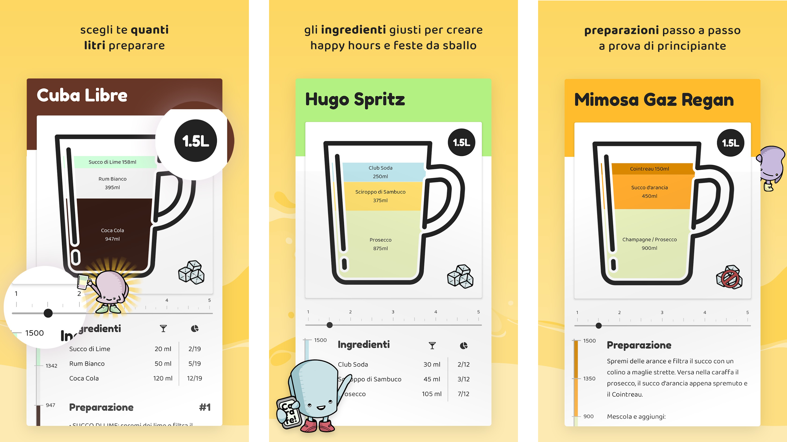
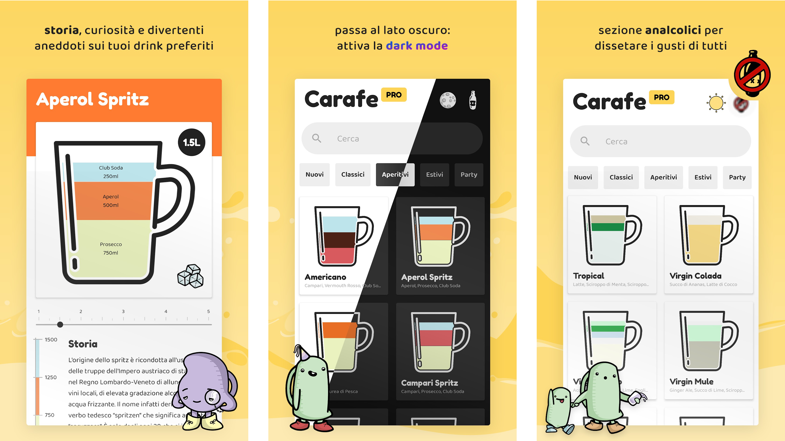

> :warning: **WIP**: Carafe is currently in 🍝 **Italian** only. Will update this readme once English will be available.

Download on `Play Store` :
- [Carafe](https://bit.ly/carafe-app)
- [Carafe Pro](https://bit.ly/carafe-pro)

Download on `App Store` :
- _Coming soon_

#### 🔍 COS'È CARAFE?
Carafe è un applicazione che ti fornisce le istruzioni necessarie per creare *grandi* cocktail in **GRANDI** quantità. Un vasto ricettario per preparare intere caraffe di cocktail alcolici e non alcolici per aperitivi, feste, happy hours.

#### 🍹 VASTA SCELTA
Da Mojito a Margarita, passando per Moscow Mule e Gin Tonic, sbizzarrisciti tra molti cocktail facili e veloci da preparare per stupire i tuoi amici, parenti e ospiti.

#### 👨🏻‍🍳 ADATTO A TUTTI
Non serve essere dei barman esperti o dei maestri della mixology! Grazie alle spiegazioni passo passo e i nostri utili consigli chiunque può preparare delle squisite caraffe a casa.

👑 Nella versione **PRO**:
- Nuovi cocktail
- Nuovi drink analcolici
- Storia e curiosità di ogni cocktail
- Nessuna pubblicità
- Dark Mode
- Continui aggiornamenti

Hai consigli, domande, o vuoi suggerirci un nuovo drink?
📬 codinghomie@gmail.com

Ti piacciono le illustrazioni che vedi? Sono state create da @ilnmgg
📬 ilemeggiolaro@gmail.com
